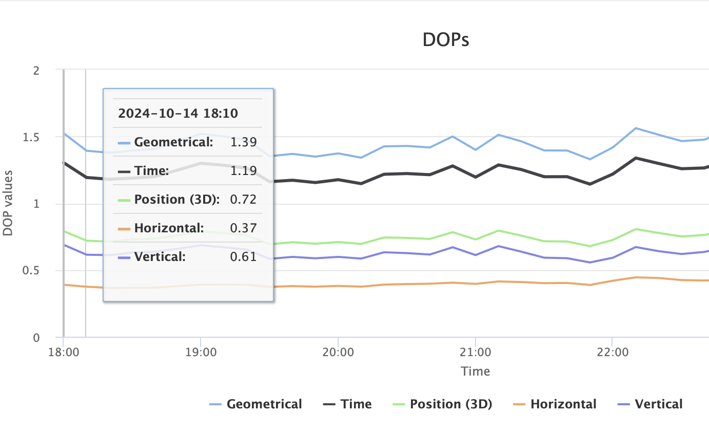
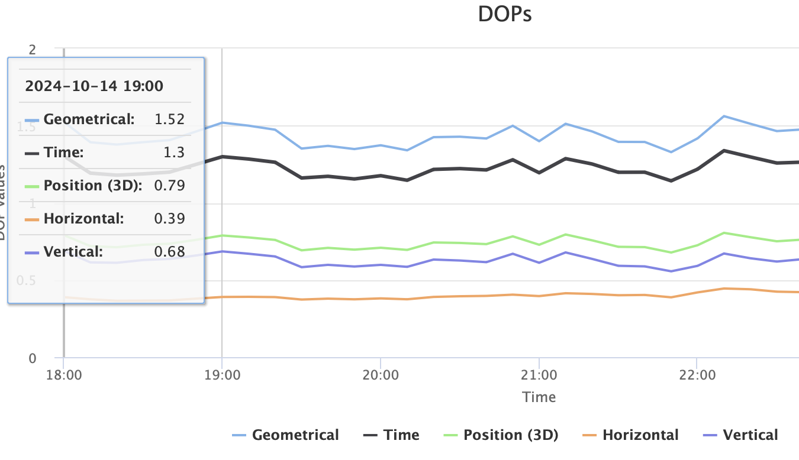

# Practical 3
> - PanZhiQing 24037665g
> - 25/10/2024 19:00


- [Practical 3](#practical-3)
  - [1. Observations and Calculations](#1-observations-and-calculations)
    - [1.1 Stand-alone GPS (positioned using pseudoranges in stand-alone mode)](#11-stand-alone-gps-positioned-using-pseudoranges-in-stand-alone-mode)
    - [1.2 DGPS (positioned using pseudoranges in differential mode)](#12-dgps-positioned-using-pseudoranges-in-differential-mode)
    - [1.3 RTK GPS (positioned using carrier phase in kinematic mode)](#13-rtk-gps-positioned-using-carrier-phase-in-kinematic-mode)
    - [1.4 RTK GNSS (positioned using carrier phase in kinematic mode)](#14-rtk-gnss-positioned-using-carrier-phase-in-kinematic-mode)
    - [1.5 Post-processing GNSS PPP (positioned using carrier phase in static mode)](#15-post-processing-gnss-ppp-positioned-using-carrier-phase-in-static-mode)
  - [2. Account for the differences between the GNSS positioning techniques](#2-account-for-the-differences-between-the-gnss-positioning-techniques)
  - [3. Analyse the differences based on the theory of the five positioning techniques](#3-analyse-the-differences-based-on-the-theory-of-the-five-positioning-techniques)
  - [Appendix](#appendix)
  - [References](#references)


## 1. Observations and Calculations

### 1.1 Stand-alone GPS (positioned using pseudoranges in stand-alone mode) 
| Point | Northing | Easting |
| --- | --- | --- |
|0m | 818705.746 | 836529.429 |
|10m | 818705.299 | 836539.417 |
|Calculation Distance: | 9.997997449503625 | - |
|Error: | -0.0020025504963747665 | - |

### 1.2 DGPS (positioned using pseudoranges in differential mode)
| Point | Northing | Easting |
| --- | --- | --- |
|0m | 818706.328 | 836529.265 |
|10m | 818705.596 | 836539.340 |
|Calculation Distance: | 10.101556761163256 | - |
|Error: | 0.10155676116325552 | - |

### 1.3 RTK GPS (positioned using carrier phase in kinematic mode) 
| Point | Northing | Easting |
| --- | --- | --- |
|0m | 818705.776 | 836529.432 |
|10m | 818705.318 | 836539.409 |
|Calculation Distance: | 9.987506846009843 | - |
|Error: | -0.012493153990156713 | - |

<div STYLE="page-break-after: always;"></div>

### 1.4 RTK GNSS (positioned using carrier phase in kinematic mode) 
| Point | Northing | Easting |
| --- | --- | --- |
|0m | 818705.786 | 836529.439 |
|10m | 818705.322 | 836539.410 |
|Calculation Distance: | 9.981790270303003 | - |
|Error: | -0.018209729696996746 | - |

### 1.5 Post-processing GNSS PPP (positioned using carrier phase in static mode) 
- In the local coordinate system, the coordinates of the two points are as follows:
   | Point | UTM Northing | UTM Easting |
   | --- | --- | --- |
   |0m | 2469547.553 | 209404.775 |
   |10m | 2469538.031 | 209401.867 |
   |Calculation Distance: | 9.956151264304165 | - |
   |Error: | -0.04384873569583547 | - |

- In the 3D space, the coordinates of the two points are as follows:
   | Point | X | Y | Z |
   | --- | --- | --- | --- |
   |0 | -2418120.5654 | 5385741.1718 | 2405920.7909 |
   |1 | -2418121.5392 | 5385736.6821 | 2405929.6164 |
   |Calculation Distance: | 9.949630283712642 | - |
   |Error: | -0.0503697162873582 | - |

## 2. Account for the differences between the GNSS positioning techniques

| Technique | Theory |
| --- | --- |
| Stand-alone GPS | Stand-alone GPS positioning uses pseudoranges for positioning, without additional correction information. It is limited by factors such as atmospheric errors, satellite orbits, and clock errors, so its accuracy is relatively low. |
| DGPS | Differential GPS can reduce errors in stand-alone GPS by receiving correction information sent by reference stations, such as ionospheric and tropospheric errors. |
| RTK GPS | RTK GPS uses carrier phase measurements to improve accuracy. It requires real-time transmission of carrier phase information between the base station and the rover. |
| RTK GNSS | RTK GNSS is similar to RTK GPS, but it can use signals from multiple satellite systems, such as GPS, GLONASS, Galileo, etc., to provide more available satellites for improved accuracy and availability. |
| Post-processing GNSS PPP | PPP does not require a reference station, but uses precise orbit and clock correction information to achieve decimeter to centimeter-level positioning accuracy. In this experiment, we performed post-processing using precise orbit and clock correction data after the observation (the procise reference data udated about 10.22). |

## 3. Analyse the differences based on the theory of the five positioning techniques

| Technique | Distance (m) | Error (m) |
| --- | --- | --- |
| Stand-alone GPS | 9.997997449503625 | **-0.0020025504963747665** |
| DGPS | 10.101556761163256 | **0.10155676116325552** |
| RTK GPS | 9.987506846009843 | -0.012493153990156713 |
| RTK GNSS | 9.981790270303003 | -0.018209729696996746 |
| Post-processing GNSS PPP | 9.956151264304165 | -0.04384873569583547 |

If we consider the true value is 10m :
   - Stand-alone GPS(about 0.002) & DGPS(about 0.1) : The measurement result of Stand-alone GPS is the closest to the true value, while the error of DGPS is the largest among all measurements.
   - RTK GPS & RTK GNSS(about 0.01 - 0.02) : The measurement results of RTK GPS and RTK GNSS are similar, with the error of RTK GNSS slightly larger than that of RTK GPS.
   - Post-processing GNSS PPP(about 0.04) : The error is larger than RTK.
  
Here, some anomalies have occurred, where some methods that were originally considered to be high-precision have larger errors, indicating that the accuracy of GPS positioning technology is affected by multiple factors.

| Technique | Analysis |
| --- | --- |
| Stand-alone GPS | The error of Stand-alone GPS positioning is **-0.002 meters**, which is close to the ideal value. This small error may be due to good signal reception conditions, and the error has not been significantly amplified. I checked the satellite distribution during the measurement, and the satellite distribution conditions were good at that time (18:10-18:20, Figue 1), while the subsequent measurement DOP gradually increased, which is also a possible influence. |
| DGPS | The calculated distance error of DGPS is **0.101 meters**, which is larger than that of Stand-alone GPS. Although differential technology usually improves accuracy, the actual effect is limited by the distance between the base station and the rover, as well as signal propagation paths and other conditions. |
| RTK GPS | The error of RTK GPS is **-0.012 meters**, which is relatively accurate. This is because carrier phase measurements have high accuracy and can effectively reduce common error sources such as satellite clock errors and ionospheric errors. |
| RTK GNSS | The error of RTK GNSS is **-0.018 meters**, slightly larger than RTK GPS. This may be related to satellite combinations, signal environments, and multipath effects during observation. Although GNSS uses multiple satellite systems, the impact of signal propagation environments cannot be ignored. At the same time, the satellite DOP at this time (19:00, Figue 2) gradually increased, which will have a certain impact. |
| Post-processing GNSS PPP | The error of PPP is **-0.043 meters**, slightly larger than RTK technology. This may be related to the atmospheric conditions and satellite distribution at that time. Considering that PPP requires long-term observation (15 minutes) with instruments, receiver noise errors, ionospheric errors, etc., may accumulate during this time. |



Figure 1: Satellite distribution at 18:10-18:20

Figure 2: Satellite distribution at 19:00

> - Data Source: https://www.gnssplanning.com/
> - Date & Time: 14/10/2024 18:10-20:00
> - Location: Hong Kong (N 22° 18' 24.8727", E 114° 10' 46.1023")


<div STYLE="page-break-after: always;"></div>

## Appendix
1. Code for calculating the distance:
```python
import math

def calculate_distance(x1, y1, x2, y2):
    return math.sqrt((x1 - x2) ** 2 + (y1 - y2) ** 2)

# Stand-alone GPS
distance_gps = calculate_distance(818705.746, 836529.429, 818705.299, 836539.417)
error_gps = distance_gps - 10

# DGPS
distance_dgps = calculate_distance(818706.328, 836529.265, 818705.596, 836539.340)
error_dgps = distance_dgps - 10

# RTK GPS
distance_rtk_gps = calculate_distance(818705.776, 836529.432, 818705.318, 836539.409)
error_rtk_gps = distance_rtk_gps - 10

# RTK GNSS
distance_rtk_gnss = calculate_distance(818705.786, 836529.439, 818705.322, 836539.410)
error_rtk_gnss = distance_rtk_gnss - 10

# Post-processing GNSS PPP
distance_ppp = calculate_distance(2469547.553, 209404.775, 2469538.031, 209401.867)
error_ppp = distance_ppp - 10

def calculate_distance_3d(x1, y1, z1, x2, y2, z2):
    return math.sqrt((x1 - x2) ** 2 + (y1 - y2) ** 2 + (z1 - z2) ** 2)

# in one print message
print(f"Stand-alone GPS: Distance = {distance_gps}, Error = {error_gps}\n"
      f"DGPS: Distance = {distance_dgps}, Error = {error_dgps}\n"
      f"RTK GPS: Distance = {distance_rtk_gps}, Error = {error_rtk_gps}\n"
      f"RTK GNSS: Distance = {distance_rtk_gnss}, Error = {error_rtk_gnss}\n"
      f"Post-processing GNSS PPP: Distance = {distance_ppp}, Error = {error_ppp}\n"
      f"Post-processing GNSS PPP 3D: Distance = {distance_ppp_3d}, Error = {error_ppp_3d}")

# Output: 
# Stand-alone GPS: Distance = 9.997997449503625, Error = -0.0020025504963747665
# DGPS: Distance = 10.101556761163256, Error = 0.10155676116325552
# RTK GPS: Distance = 9.987506846009843, Error = -0.012493153990156713
# RTK GNSS: Distance = 9.981790270303003, Error = -0.018209729696996746
# Post-processing GNSS PPP: Distance = 9.956151264304165, Error = -0.04384873569583547
# Post-processing GNSS PPP 3D: Distance = 9.949630283712642, Error = -0.0503697162873582
```

2. Original PPP Data & Calculation Result Link : https://github.com/pzq123456/LSGI522/tree/main/Practicals/Practical3/data

## References
1. https://www.gnssplanning.com/