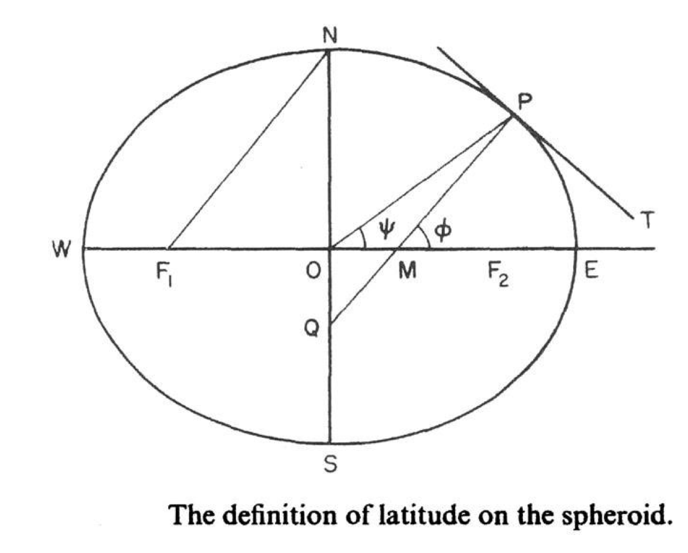
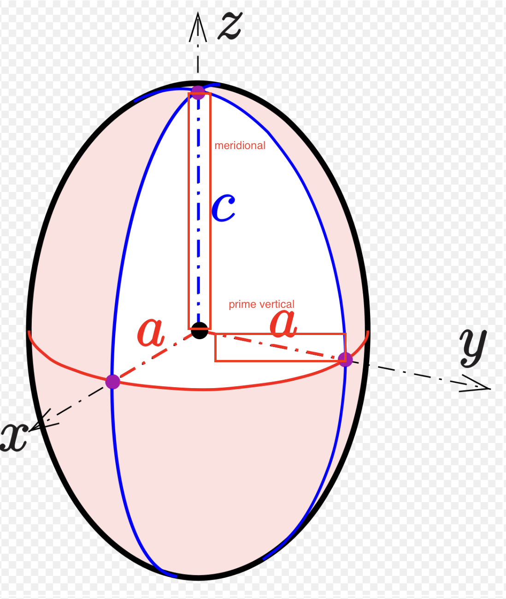
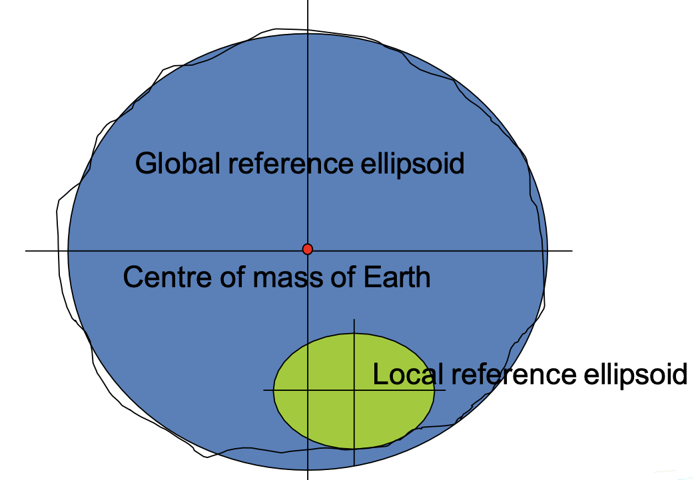

# Topic 1 Geo-reference system, 2D and 3D coordinate systems

## Questions from exams

### 1. Question 2 (2022) Explain the following terms with an aid of diagram: 
1. Geodetic and geocentric latitude  (2 marks) 
    - Geodetic latitude(φ) : The angle in the meridional plane generated by the **spheroid normal**
    - Geocentric latitude, ψ (psi) : The angle in the meridional plane generated at the **spheroid centre**
    - 
2. For a prolate spheroid: meridional radius and prime vertical radius (2 marks) 
   - 子午线半径（meridional radius）：子午线方向上的曲率半径
   - 卯酉线半径（prime vertical radius）：卯酉线（垂直于子午线的线）方向上的曲率半径
   -  
3. The geoid and ellipsoid (1 mark) 
   - Equipotential surfaces are those with same gravitational potential energy
   - The equipotential surface that represents mean sea level (MSL) is called the Geoid. This is an irregular surface that responds to variation in mass, M.
   - The ellipsoid is a regular surface that is used to approximate the geoid. It is a mathematical model of the Earth's shape.
   - The most suitable spheroid for Earth is an oblate spheroid
   - 

