# Topic 2 Land surveying
## Word List
| English | Chinese | English | Chinese | English | Chinese |
|---------|---------|---------|---------|---------|---------|
| precise | 精确的 | accurate | 准确的 | standard deviation | 标准偏差 |
| Geodetic | 大地测量 | Topographic | 地形测量 | Engineering | 工程测量 |
| Cadastral | 地籍测量 | - | - | - | - |
| Gross errors | 粗差 | Systematic errors | 系统误差 | Random errors | 随机误差 |
| azimuth | 方位角 | bearing | 方位角 | Electromagnetic distance measurement | 电磁距离测量 |
| Radiation | 辐射法 | Intersection | 交会法 | Resection | 重测法 |
| Vertical axis | 垂直轴 | Collimation axis | 瞄准轴 | Trunnion axis | 转轴 |

## Key concepts

1. accurate : Accuracy is the degree of absence of error. All observation contain error
2. Error :
  - Gross errors (mistakes) : Eliminate gross errors by care and technique.
  - Systematic errors (bias) : Identify, model and minimise effects of systematic errors
  - Random errors (left over) : Statistically analyse random errors
3. precise : Precision relates to reliability. Represented by standard deviation (𝜎𝜎) or variance (𝜎^2)
4. standard deviation : 方差开根号
   - 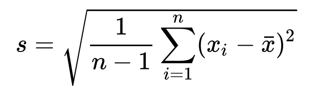
   - ```py
      list = [99, 90, 100, 91, 94, 93, 98, 93, 91, 96]

      def standard_deviation(list):
          n = len(list)
          mean = sum(list) / n
          print(mean)
          variance = sum((x - mean) ** 2 for x in list) / (n - 1)
          print(variance)
          return variance ** 0.5

      print(standard_deviation(list))
      ```
5.  propagation of errors
  - Effects of error assessed by propagation of errors 误差传播定律
  - 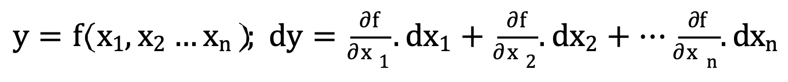
    - 其中 dy 就是误差
  - Precision (σ) assessed by the special law of error propagation (σ^2)
  - 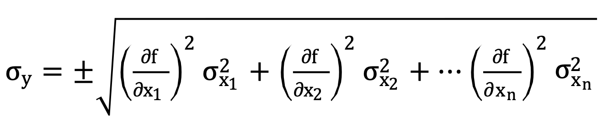
    - 注意前面的正负号
  - Example: 
    - A distance, y, is made up of three parts
    - x1 = 23.65 m, x2 = 28.83 m, x3 = 33.92 m
    - y = f (x1, x2, x3) = x1 + x2 + x3
    - t was found that three distances have errors proportional to their length:
      - E = −0.002 ∗ x (This would be a systematic error)
      - dx1 = −0.047 m, dx2 = −0.058 m, dx3 = −0.068 m
    - What is the error of the computed distance?
      - 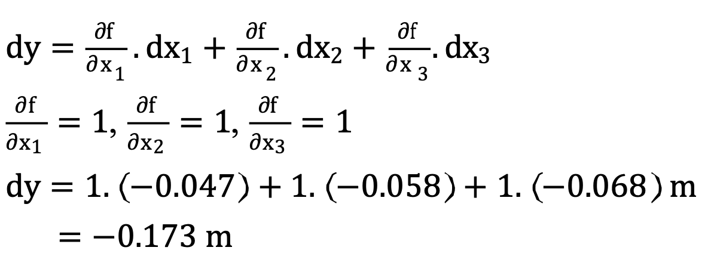
    - What if those “errors” were the precisions of each distance?
      - 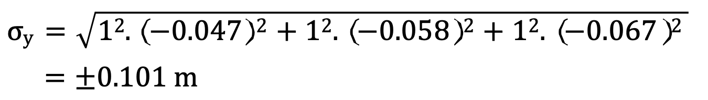
6. Types of land surveying
  - Geodetic: Measurement of the shape of the Earth
  - Topographic: Measurement of the shape of the Earth’s surface
  - Engineering: Dimension and location control of construction projects
  - Cadastral: Definition of land parcel boundaries

7. bearing & azimuth
  - azimuth : When oriented to True North it becomes an azimuth (α)
  - bearing : When the direction is oriented it becomes a bearing (β)
  - 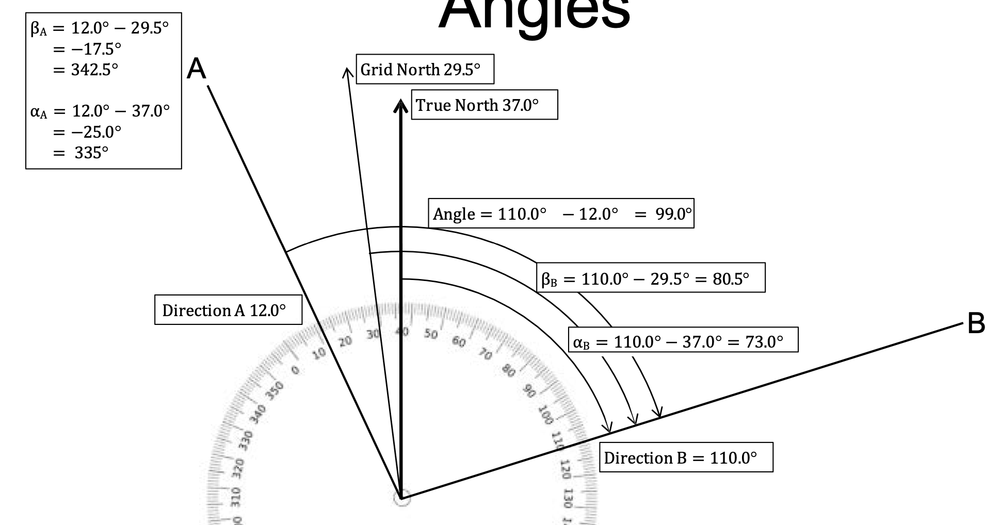

8. Radiation
   - 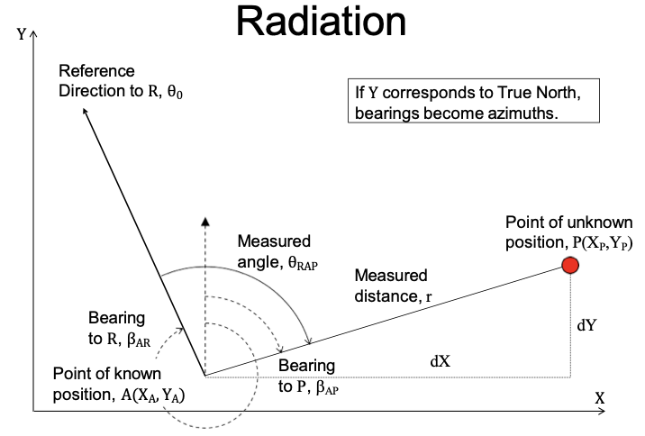
   - Unknown point, P, is located with respect to a known point, A, by the polar measurement of
     - Angle, θ measured clockwise
     - Distance, r
   - Requires a reference direction, θ0
   - Polar is resolved into dX and dY

9.  Intersection
    - 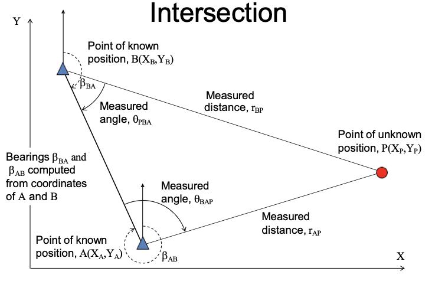 
    - Unknown point, P, is located with respect to two known points, A and B, by either
      - Measurement of two angles (θBAP,θPBA)
      - Measurement of two distances (rAP,rBP)
      - Measurement of one angle and one distance from different points (θBAP,rBP) or (rAP,θPBA)

10. Resection
    - 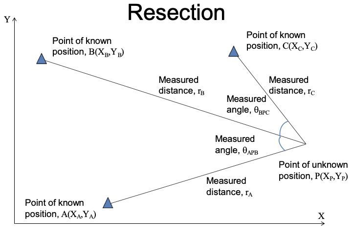
    - Unknown point, P, is located with respect to three known points, A, B and C by
      - Measurement of three angles
      - Measurement of three distances

11. Traversing
  - Start from a control point and locate new points by successive radiations
  - End on
    - Starting point, closed loop traverse
      - 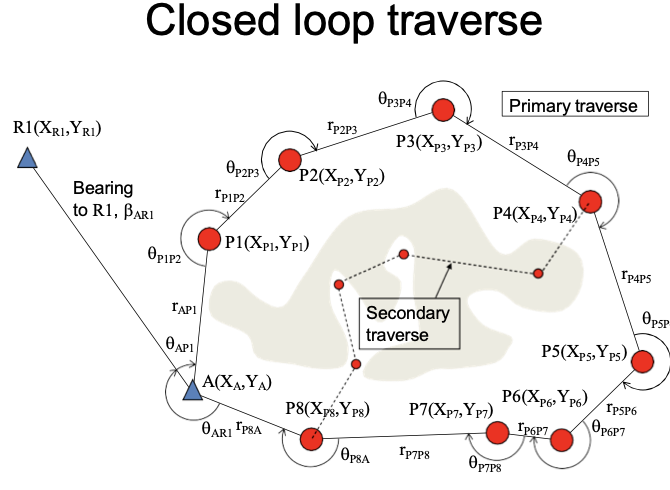
      - Scale error not detectable
      - Orientation error
    - Another control point, closed traverse
    - 
  - Both need additional points for traverse orientation
  - Open traverse should be avoided
  - Instruments used are theodolites and tapes

12. Instrument types
    - Three basic categories
      - Angle measurement - theodolites
        - Vertical (standing) axis, Collimation axis, Trunion (Transit) axis
      - Distance measurement - tapes, EDM
      - Height difference measurement - levels
    - First two used to be separate instruments now combined into the Total Station

13. Control networks
    - Control networks cover large areas and, up to a point, use geodetic surveying
      - First order control is at the national level
      - Second order control is at the regional level
      - Third order control is at the local level
## Questions from exams

### 1. Question 25  
   - (a) Which of the following coordinates is more precise? Why?  (4 marks) 
     - A. 114.157690E, 22.285520N   
     - B. 114.160E, 22.290N 
   - (b) Which of the following coordinates is more accurate? Why?  (4 marks) 
     - A. 114.157690E, 22.285520N    
     - B. 114.160E, 22.290N 
   - (c) What is the standard deviation of the numbers 3, 8, 12, 17 and 25?  (2 marks) 

### 2, Question 5   
- (a) What is Traversing? List TWO instruments have to deploy for traversing. (1 mark) 
  - 
- (b) With an aid of the diagrams, explain what are Closed Link Traverse and Close Loop Traverse. How many survey control points are needed for both traverses? Why? (3 marks) 
- (c) Why open traverse is always not encouraged?   (1 mark) 
- (d) List the steps involved in manual traverse computation.  (1 mark) 

### 3. Question 23   
- (a) What heights do GPS, Leveling, Gravity and Satellite Altimetry measure?  (1 marks) 
- (b) Traversing, intersection and resection are positioning techniques used in topographic surveying. Accurately describe each of them and give examples of how each may be used in a topographic survey project.


### 4.Question 3 Refer to the following diagram and given data, what are the coordinates of C?  (5 marks)
- 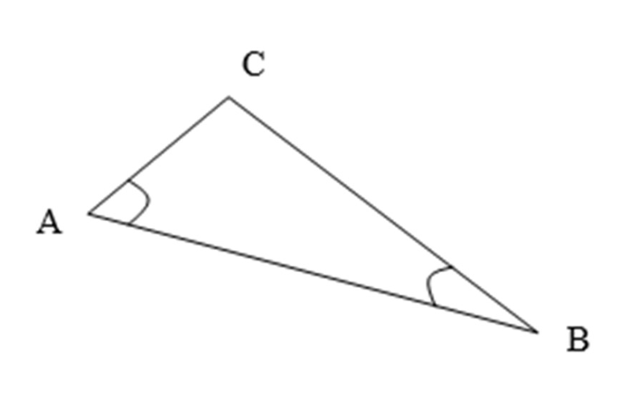
- Given: 
  - Coordinates of A = (725.10, 301.75) 
  - Coordinates of B = (957.85, 258.40)   
  - Angle A = 59 ̊ 30ʹ 48ʺ 
  - Angle B = 32 ̊ 22ʹ 40ʺ

### 5. Question 3 Refer to the following diagram and given data, what are the coordinates of C? (7 marks) 
- 
- Given: 
  - Coordinates of A = (2589.40, 6717.85) 
  - Coordinates of B = (4717.77, 5625.10)  
  - Angle A = 63 ̊ 40ʹ 28ʺ 
  - Angle B = 42 ̊ 02ʹ 04ʺ