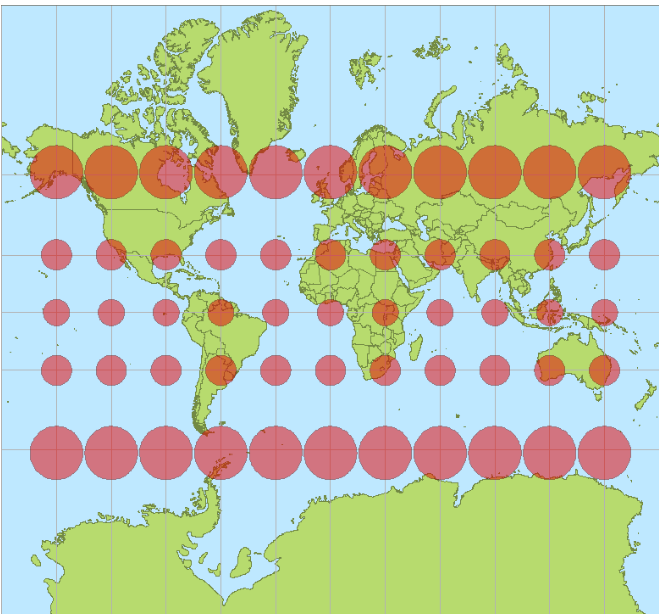

# Topic 3 Map Projections
## Word List
## Key concepts
1. Scale : 
   - The most informative classification. **The ratio of** the distance on the map to its corresponding distance on the “object”.
   - s = D / d
   - The scale number is the ratio 
   - sn = d / D
   - Scale is usually written 1: sn
   - Smaller sn means more detail can be seen and measurements are more “accurate”

2. What the maps are showing
   - General purpose maps 
   - Specific purpose maps : 
     - Cadastral plans and maps Showing delineation and ownership of land and real property
     - Nautical charts : For navigation of boats and ships
   - Thematic maps
     - Used to portray very specific information
     - The content controls how scale is utilised
     - Many different styles
   - Planimetric maps : These are maps and plans that contain accurate 2D spatial information
   - Topographic maps : Maps and plans that show the shape of the Earth’s or other bodies’ surface
   - Topological maps : 
     - Topology describes the connectivity of items
     - Consists of the concepts of nodes, edges and faces
     - Useful for navigation
   - Hydrographic/bathymetric maps/charts
   - Tactile maps

3. Map projections
   - Why Map Projection? 
     - Maps are flat, so the coordinates of geodetic  points used to control mapping have to be plane  coordinates, otherwise they will be unrelated, for  one belongs to the plane system and the other the  ellipsoid system.
   - What is a map projection? 
   - Establishing the corresponding relationship between geodetic coordinates (𝜙,𝜆) or say (B, L) and plane coordinates therefore becomes necessary, according to certain mathematical rules, which is called projection.

4. Projections classified by how they are created(Four elements) : 
   - The four elements are:
    | Aspect | Class | Contact | Property |
    |--------|-------|---------|----------|
    | Normal | Azimuthal | Tangent | Conformality |
    | Transverse | Conic | Secant | Equidistance |
    | Oblique | Cylindrical | - | Equivalence |

   - Aspect
     - Normal
       - Axis of projection surface coincides with the rotation axis of the globe
     - Transverse
       - Normal aspect turned 90°
     - Oblique
       - Projection surface is at an angle to the globe
   - Class
     - Azimuthal (zenithal)
       - Sphere projected onto a plane
     - Conic
       - Sphere projected onto a cone
     - Cylindrical
       - Sphere projected onto a cylinder
   - Contact
     - Tangent
       - The projection surface touches the surface of the globe
     - Secant
       - The projection surface intersects the surface of the globe
   - Property
     - Conformality a = b
       - Samescalein all directions preserves local shape
     - Equidistance h = 1 or k = 1
       - Distances are correct from a point or along a line
     - Equivalence 𝑝𝑝 = 𝑎 * 𝑏 = 1
       - Areas over map are proportionally correct

5.  standard parallels : 
    - When the cylinder or cone is normal (axis  coincides with the Earth’s axis) the lines of  tangency or intersection are called standard parallels.

6. Evaluating distortion(ellipse of distortion) 
   - In order to evaluate the distortion of a projection five scales are important
     - Scale along the meridian, h 沿着子午线
     - Scale along the parallel, k 沿着纬线圈
     - Maximum scale at a point, a 最大比例尺
     - Minimum scale at a point, b 最小比例尺
     - Scale along any arc, µ 沿着任意弧线

## Questions from exams
### 1. Question 4 
1. Suggest a set of projection equations for parameters (r=, h=, k=, p=, ω= ), which could create an azimuthal projection with a property of equivalence  (2 marks) 

2. Create a table of values for r, h, k, p, ω at latitudes 0 , 30, 45, 60 , 90 (degree) and comment on the distortion  (2 marks)

### 2. Question 4 
- Refer to the Figure (1) and answer the following questions: 
- 
- (a) Define the term - map scale. 
  - **Map scale** refers to the relationship between a distance on the map and the corresponding distance on the ground. It is expressed as a ratio or fraction (e.g., 1:50,000), meaning that one unit of measurement on the map equals 50,000 of the same units in the real world. It can be representative, verbal (e.g., 1 inch equals 1 mile), or graphic (scale bar).

- (b) What kind of map projection does Figure (1) use? What is the parametric equation of this projection?
  - Based on the shape and structure of the figure, **Figure (1)** uses a **Mercator projection**. This is a cylindrical map projection commonly used for nautical purposes because it preserves angles and direction, making it a conformal projection. However, it distorts the size of areas, especially near the poles.

- (c) What are the characteristics of this projection?
  - The **Mercator projection** has the following characteristics:
    - **Conformal**: It preserves angles, meaning that shapes and directions are maintained.
    - **Distortion**: It distorts area, especially as you move towards the poles, making land masses like Greenland appear much larger than they are in reality.
    - **Use in navigation**: It's useful for maritime navigation because it preserves direction and straight lines represent constant compass bearings.

- (d) Suggest a name for Figure (1).

  - **Normal Cylindrical Tangent Conformal Projection (Mercator Projection)**
    - **Aspect: Normal**  
      The axis of the projection surface coincides with the Earth's rotation axis, indicating the normal aspect.
    - **Class: Cylindrical**  
      The Mercator projection is a cylindrical projection, meaning the Earth is projected onto a cylinder.
    - **Contact: Tangent**  
      The cylinder is tangent to the Earth at the equator, meaning it touches the globe's surface along a line.
    - **Property: Conformality**  
      The Mercator projection is conformal, preserving angles and local shapes but distorting areas, especially towards the poles.

- (e) What are the red dots in Figure (1)? What are the indications of these dots?
  - The **red dots** in **Figure (1)** represent **ellipse of distortion**. These are circles used to visualize the distortion caused by the projection. In the case of the Mercator projection:
  - Near the equator, the circles are close to their real proportions, showing minimal distortion.
  - As you move towards the poles, the circles become stretched vertically, indicating the increasing area distortion (inflation of landmass size).
  - These dots help indicate how the projection distorts shapes and areas differently across the map.

## Universal Transverse Mercator (UTM)
- UTM is not a new ⁄ revised projection. It just uses the Transverse Mercator to generate a series of maps. UTM is often wrongly described as a projection.
- UTM “projects” the Earth (as sphere or ellipsoid) 60 times and creates 60 UTM Zones.
- Each UTM Zone is in fact a different projection using a different system of coordinates.