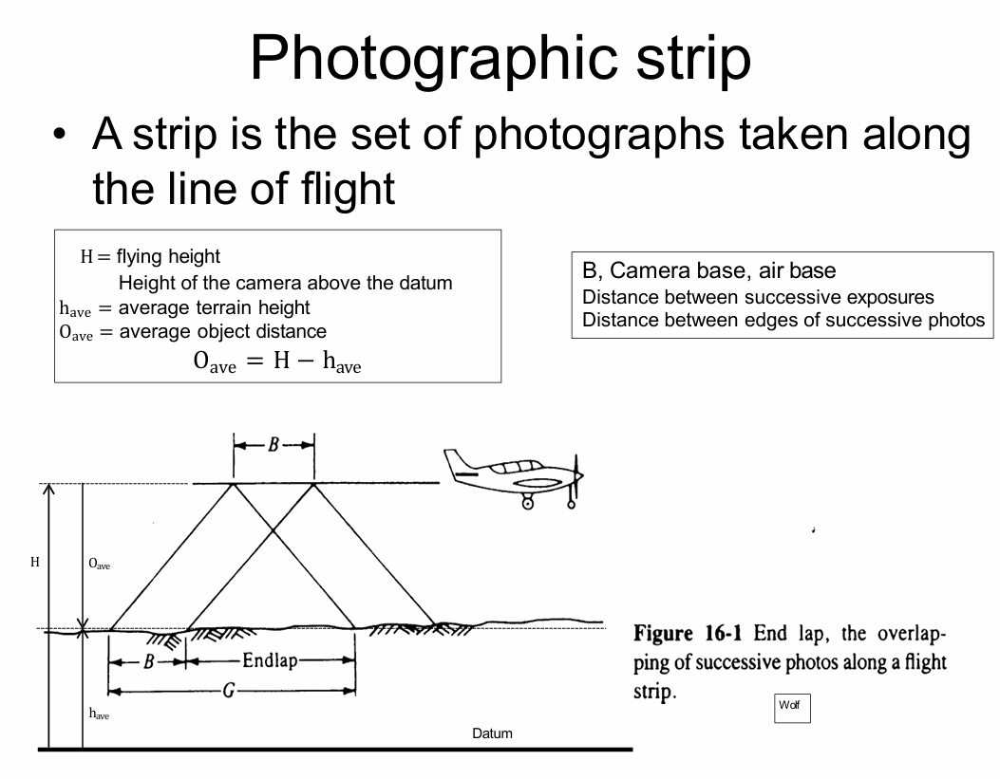
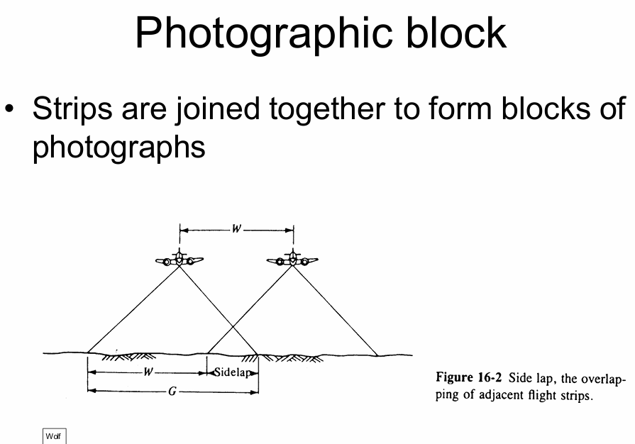
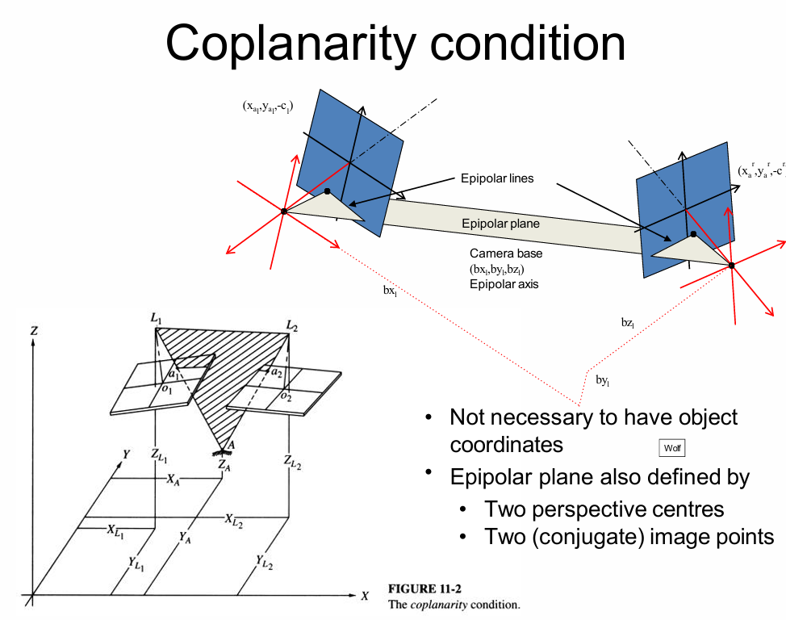

# Topic 4 - Photogrammetry

## Word List
## Key concepts
1. Photographic strip : A strip is the set of photographs taken along the line of flight
   - 
   - End lap, E : This  is  the  amount  by  which  the  photographs overlap along the strip
   - E = (G-B)/G * 100%

2. Side lap, S : 
  - Lateral separation of flight lines is the strip spacing, W 
  - Side lap is the amount of overlap across the block
  - S = (G-W)/G * 100%
  - 

3. Operations
   1. Exterior orientation : Recreate  geometric  relationship  between images and object.
   2. Interior orientation : Define the internal geometry of the camera and stablish relationship between measuring system and images.

## Questions from exams
### 1. Question 7 : 
- The area for an aerial photogrammetric mapping project is 6.8 kilometers long and 4.6 kilometers wide. The photographic scale is 1:15,000. Calculate the minimum number of photographs (size of each photograph is 25 cm by 25 cm) that will be needed to provide stereoscopic coverage of the area if the photographs are to have 80% end-lap and 40% side-lap. (6 marks)

### 2. Draw  clear  and  accurate  diagrams  that  illustrate  that  the  coplanarity  condition in photogrammetry can be represented by two instances of the collinearity condition. (5 marks)
- 

## Photogrammetry
- The photogrammetry
    - Take two (or more) images that overlap from different locations
    - Re-establish relationship between object and camera by measuring points on the images
    - Re-create a model of the object by “back projection”
### Model
1. Base : Object 双目摄像机的瞳距，从地物看向两个摄像机的视线连线角度越大，对高度的计算约精确（与GPS定位相同，需要更多的卫星及更大的可视角度）也叫 good geometry. 
   - x-parallax : 从不同的角度看同一个东西
   - B(air base, Camera base): O controls parallactic (intersection) angles and x-parallax
   - Larger angles give more precise object distances (heights)
2. Types of photogrammetry
   * The type of equipment used
       - Analogue (一个机器，防止两张照片，使用眼睛同时看两个照片，也就是利用立体视觉)
       - Analytical （相对第一个小一点的机器）
       - Digital (数码)
   * The type of cameras used
    - Metric (公制)
       * Stable geometry （稳定的几何）
       * Designed for photogrammetry （为摄影测量设计）
    - Non-metric (非公制) 需要做更多的校正
       * Unstable internal geometry （不稳定的内部几何）
       * Consumer cameras （消费级相机）
       * note : distortion: 畸变，相机的可视角度越大，畸变越大

3. Types of photogrammetry
    * Aerial(空中)
        - Camera in the sky(天空)
        - Pointing towards the ground(指向地面)
    * Terrestrial(地面)
        - On or close to the ground
        - Pointing
            * Horizontally(水平)
            * Obliquely upwards or downwards(斜向上或向下)

### Aerial photogrammetry
- Parallel axis
- Taken from above the ground
    - Vertical – no tilt from vertical axis （垂直）
    - Near vertical – less than 3° tilt from vertical （近垂直）
    - Low oblique – no horizon （低斜，没有地平线）
    - High oblique – includes horizon （高斜，包括地平线）
- Overlapping with parallel axis geometry 
    - Strips and blocks （条带和块）
- Kite, balloon, aeroplane, spacecraft …

### Photographic strip
1. A strip is the set of photographs taken along the line of flight（飞行线，飞行线上拍摄的照片集）
2. End lap, E. For stereoscopic viewing E is typically 60% − 80%
   $$ E = \frac{G-B}{G} \times 100\% $$
   > Note:   
   > - Photographs may be taken with 90% or 80% end lap
   > - Less than 50% end lap will not guarantee
   > - More than 60% end lap reduces the amount of x-parallax and produces poorer accuracy stereo models but is easier to view(Stereo model is the 3D view from a pair of stereoviewable photographs)

3. Side lap, S
   $$ S = \frac{G-W}{G} \times 100\% $$
   - Lateral separation of flight lines is the strip spacing, W(条带间距，横向分离的飞行线是条带间距)
   - Side lap is the amount of overlap across the block
   - S is typically 30% of G so W is 70% of G

## Photogrammetric operations
1. operations
- Before products can be created (在产品创建之前)
  - Recreate geometric relationship between images and object (重新创建图像和对象之间的几何关系)
- Exterior orientation (外部定向)
  - Define the internal geometry of the camera and stablish relationship between measuring system and images  (定义相机的内部几何，并建立测量系统与图像之间的关系)
  - Interior orientation (内部定向)
- Data then created by 3D digitising either manually or automatically (数据然后通过3D手动或自动数字化创建)

2. Exterior orientation : Recreate the geometric relationship between the image coordinates and the object coordinates. Two approaches to EO : 
   1. Two-step solution (两步解决方案)
       - Relative orientation (RO) (相对定向)
       - Absolute orientation (AO) (绝对定向)
       - A stereopair at one time (一次一个立体对)
   2. Direct solution (直接解决方案) 需要构造共线性方程
        - Collinearity (space resection) (共线性)
        - 1 or more photos at a time (一次一个或多个照片)
        - Simultaneous computation of EO and object coordinates (同时计算EO和对象坐标)
          - Bundle or block adjustment (BA) (捆绑或块调整)
            - Collinearity equations (共线性方程) 同样的点在同一条直线上（物体点，像点，光束点在同一条直线上）

3. Interior orientation (IO)
- EO requires measurement on images in the image coordinate system (EO需要在图像坐标系中测量图像)
- Instruments have own coordinate system (仪器有自己的坐标系)
- IO relates the two coordinate systems (IO将两个坐标系相关联)
  - 2D coordinate transformations (2D坐标变换)
- Rigid body, conformal, affine, projective (刚体，保角，仿射，投影)
  - Allows for distortion correction (允许畸变校正)
    - Camera calibration parameters to be applied (相机校准参数应用)
    - Corrections for image deformation to be applied (应用图像变形校正)
  
4. Image space coordinates
   - 3D origin is perspective centre
   - 2D origin is the principal point
   - x axis is in direction of travel (to the right) Defined by fiducial marks x
   - Conformal transformation 
     - When there is no change in shape
   - Affine transformation
     - When there is a change in shape between the times Of photography and measurement

5. Exterior orientation
6. Relative orientation
   - Establish the relative relationship between a pair of images
   - Use an arbitrary coordinate system based on left image perspective centre and set xr = 1
   - Solve for ω,φ,κ,YL,ZL. Require 5 conjugate point pairs
   - Typically observe von Gruber points

## 参考书
- Close range photogrammetry and machine vision.
- Elements of photogrammetry.