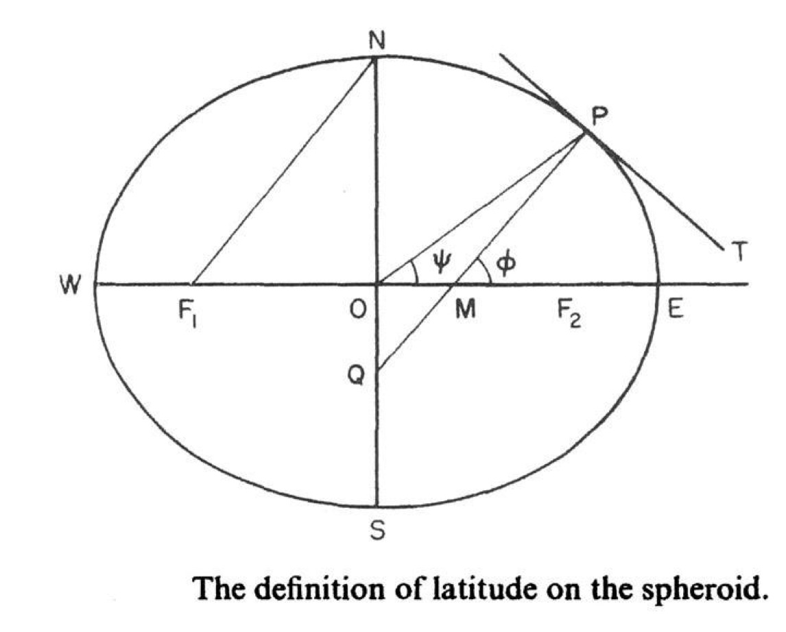
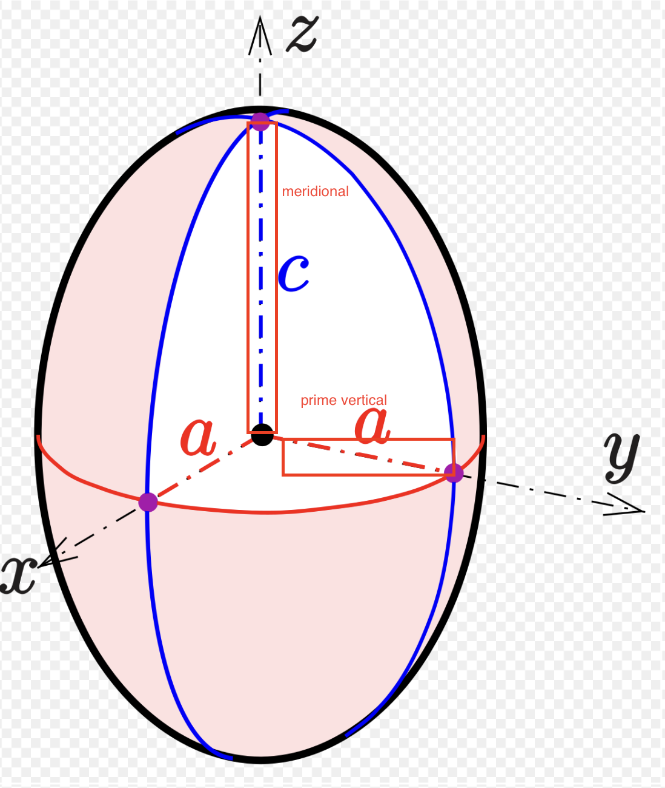
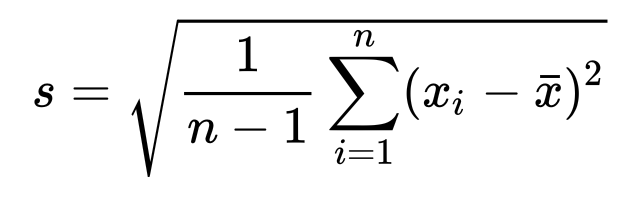
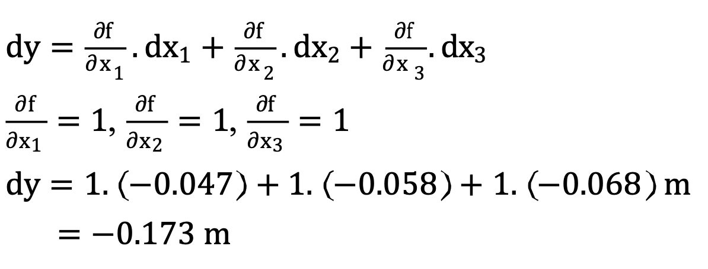
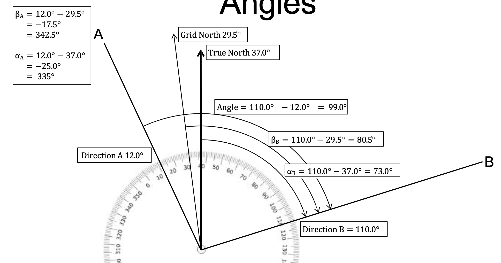
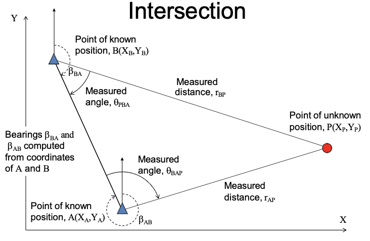
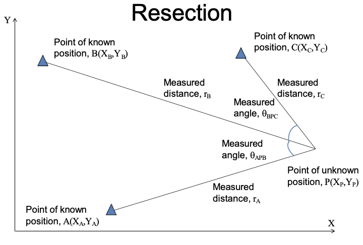
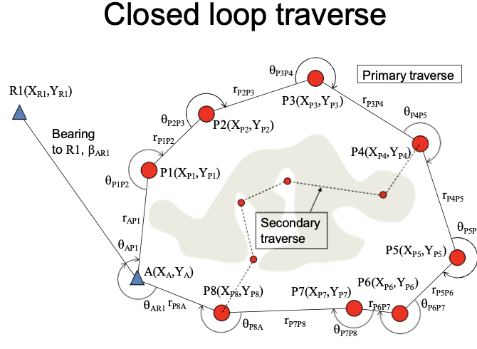
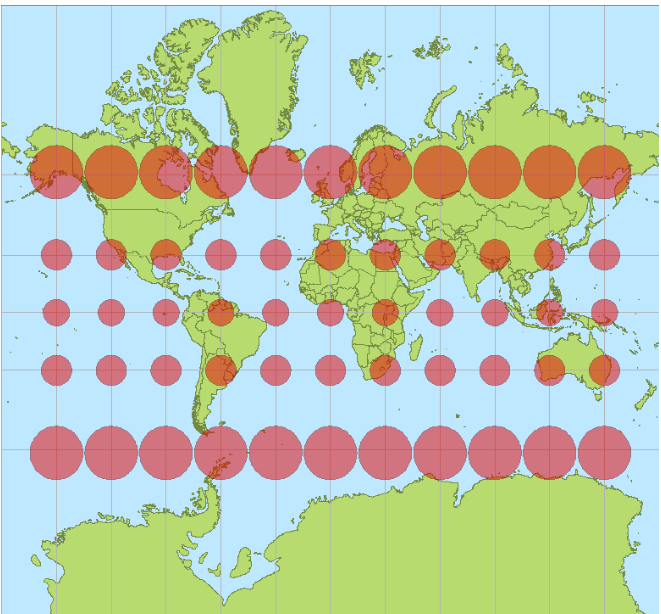
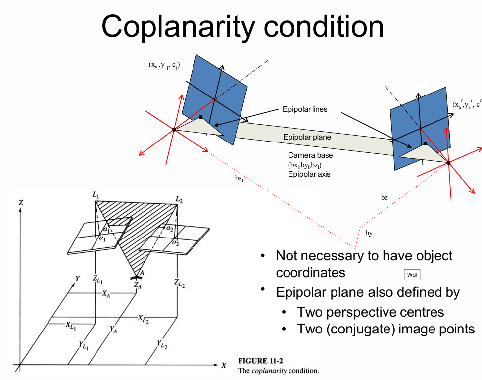

# Topic 1 Geo-reference system, 2D and 3D coordinate systems

## 1. Question 2 (2022) Explain the following terms with an aid of diagram: 
1. Geodetic and geocentric latitude  (2 marks) 
    - Geodetic latitude(φ) : The angle in the meridional plane generated by the **spheroid normal**
    - Geocentric latitude, ψ (psi) : The angle in the meridional plane generated at the **spheroid centre**
    - 
2. For a prolate spheroid: meridional radius and prime vertical radius (2 marks) 
   - 子午线半径（meridional radius）：子午线方向上的曲率半径
   - 卯酉线半径（prime vertical radius）：卯酉线（垂直于子午线的线）方向上的曲率半径
   -  
3. The geoid and ellipsoid (1 mark) 
   - Equipotential surfaces are those with same gravitational potential energy
   - The equipotential surface that represents mean sea level (MSL) is called the Geoid. This is an irregular surface that responds to variation in mass, M.
   - The ellipsoid is a regular surface that is used to approximate the geoid. It is a mathematical model of the Earth's shape.
   - The most suitable spheroid for Earth is an oblate spheroid
   - 


# Topic 2 Land surveying
## Key concepts

1. accurate : Accuracy is the degree of absence of error. All observation contain error
2. Error :
  - Gross errors (mistakes) : Eliminate gross errors by care and technique.
  - Systematic errors (bias) : Identify, model and minimise effects of systematic errors
  - Random errors (left over) : Statistically analyse random errors
3. precise : Precision relates to reliability. Represented by standard deviation (𝜎𝜎) or variance (𝜎^2)
4. standard deviation : 方差开根号
   - 
   - ```py
      list = [99, 90, 100, 91, 94, 93, 98, 93, 91, 96]

      def standard_deviation(list):
          n = len(list)
          mean = sum(list) / n
          print(mean)
          variance = sum((x - mean) ** 2 for x in list) / (n - 1)
          print(variance)
          return variance ** 0.5

      print(standard_deviation(list))
      ```
5.  propagation of errors
  - Effects of error assessed by propagation of errors 误差传播定律
  - 
    - 其中 dy 就是误差
  - Precision (σ) assessed by the special law of error propagation (σ^2)
  - 
    - 注意前面的正负号
  - Example: 
    - A distance, y, is made up of three parts
    - x1 = 23.65 m, x2 = 28.83 m, x3 = 33.92 m
    - y = f (x1, x2, x3) = x1 + x2 + x3
    - t was found that three distances have errors proportional to their length:
      - E = −0.002 ∗ x (This would be a systematic error)
      - dx1 = −0.047 m, dx2 = −0.058 m, dx3 = −0.068 m
    - What is the error of the computed distance?
      - 
    - What if those “errors” were the precisions of each distance?
      - 
6. Types of land surveying
  - Geodetic: Measurement of the shape of the Earth
  - Topographic: Measurement of the shape of the Earth’s surface
  - Engineering: Dimension and location control of construction projects
  - Cadastral: Definition of land parcel boundaries

7. bearing & azimuth
  - azimuth : When oriented to True North it becomes an azimuth (α)
  - bearing : When the direction is oriented it becomes a bearing (β)
  - 

8. Radiation
   - 
   - Unknown point, P, is located with respect to a known point, A, by the polar measurement of
     - Angle, θ measured clockwise
     - Distance, r
   - Requires a reference direction, θ0
   - Polar is resolved into dX and dY

9.  Intersection
    -  
    - Unknown point, P, is located with respect to two known points, A and B, by either
      - Measurement of two angles (θBAP,θPBA)
      - Measurement of two distances (rAP,rBP)
      - Measurement of one angle and one distance from different points (θBAP,rBP) or (rAP,θPBA)

10. Resection
    - 
    - Unknown point, P, is located with respect to three known points, A, B and C by
      - Measurement of three angles
      - Measurement of three distances

11. Traversing
  - Start from a control point and locate new points by successive radiations
  - End on
    - Starting point, closed loop traverse
      - 
      - Scale error not detectable
      - Orientation error
    - Another control point, closed traverse
    - 
  - Both need additional points for traverse orientation
  - Open traverse should be avoided
  - Instruments used are theodolites and tapes

12. Instrument types
    - Three basic categories
      - Angle measurement - theodolites
        - Vertical (standing) axis, Collimation axis, Trunion (Transit) axis
      - Distance measurement - tapes, EDM
      - Height difference measurement - levels
    - First two used to be separate instruments now combined into the Total Station

13. Control networks
    - Control networks cover large areas and, up to a point, use geodetic surveying
      - First order control is at the national level
      - Second order control is at the regional level
      - Third order control is at the local level
## Questions from exams

### 1. Question 25  
   - (a) Which of the following coordinates is more precise? Why?  (4 marks) 
     - A. 114.157690E, 22.285520N   
     - B. 114.160E, 22.290N 
   - (b) Which of the following coordinates is more accurate? Why?  (4 marks) 
     - A. 114.157690E, 22.285520N    
     - B. 114.160E, 22.290N 
   - (c) What is the standard deviation of the numbers 3, 8, 12, 17 and 25?  (2 marks) 
### 1. (a) **Which of the following coordinates is more precise? Why?**  
   - **Answer**:  
     **A. 114.157690E, 22.285520N** is more precise.  
     - **Reason**: Precision refers to the level of detail or number of decimal places in the measurement. Coordinate A is more precise because it has more decimal places, indicating a finer level of detail (to six decimal places) compared to B, which has only three decimal places.

---

### (b) **Which of the following coordinates is more accurate? Why?**  
   - **Answer**:  
     The accuracy of the coordinates depends on how close the coordinates are to the true location.  
     - If the true location is closer to **B. 114.160E, 22.290N**, then B is more accurate.
     - If the true location is closer to **A. 114.157690E, 22.285520N**, then A is more accurate.  
     
     - **Reason**: Accuracy refers to how close a measurement is to the true value. Since we don't know the true coordinates, we cannot definitively say which one is more accurate without additional information about the actual position. However, A is more likely to be precise, but that doesn't guarantee accuracy.

---

### (c) **What is the standard deviation of the numbers 3, 8, 12, 17, and 25?**  
   - **Answer**:
     - Mean of the numbers:  
       \[
       \frac{3 + 8 + 12 + 17 + 25}{5} = \frac{65}{5} = 13
       \]

     - Squared differences from the mean:  
       \[
       (3 - 13)^2 = 100, \quad (8 - 13)^2 = 25, \quad (12 - 13)^2 = 1, \quad (17 - 13)^2 = 16, \quad (25 - 13)^2 = 144
       \]

     - Sum of squared differences:  
       \[
       100 + 25 + 1 + 16 + 144 = 286
       \]

     - Variance:  
       \[
       \frac{286}{5} = 57.2
       \]

     - Standard deviation:  
       \[
       \sqrt{57.2} \approx 7.56
       \]

     **Standard deviation = 7.56**
### 2, Question 5   
- (a) What is Traversing? List TWO instruments have to deploy for traversing. (1 mark) 
- (b) With an aid of the diagrams, explain what are Closed Link Traverse and Close Loop Traverse. How many survey control points are needed for both traverses? Why? (3 marks) 
- (c) Why open traverse is always not encouraged?   (1 mark) 
- (d) List the steps involved in manual traverse computation.  (1 mark) 

### (a) **What is Traversing? List TWO instruments that have to be deployed for traversing.**  
   - **Answer**:  
     **Traversing** is a surveying method used to establish control points by measuring angles and distances between consecutive survey points along a specific route or path.
     
     **Instruments used for traversing**:
     1. **Theodolite or Total Station**: For measuring horizontal and vertical angles.
     2. **Measuring Tape or Electronic Distance Measurement (EDM) device**: For measuring distances between points.

---

### (b) **Explain with diagrams what Closed Link Traverse and Closed Loop Traverse are. How many survey control points are needed for both traverses? Why?**  
   - **Answer**:  
     - **Closed Link Traverse**: A traverse that starts at one known control point and ends at a different known control point.  
     - **Closed Loop Traverse**: A traverse that forms a loop, starting and ending at the same known control point.  

     **Number of Survey Control Points**:  
     - **Closed Link Traverse**: At least 4 control points (one for the starting point and another for the ending point and bearing) are needed because the traverse ends at a different known point. 
     - **Closed Loop Traverse**: Only 2 control point is needed because the traverse forms a loop and returns to the same point, allowing for checks of angular and linear closure. Another control point is needed to bear the orientation of the traverse.
     
     **Reason**:  
     - Control points are necessary to tie the traverse to a known coordinate system, enabling accuracy checks and closure calculations. In a Closed Link Traverse, the second control point ensures the traverse can be checked for consistency.

     **Diagrams**:

     - **Closed Link Traverse**:
       ```
       A --------> B --------> C
       (Known)               (Known)
       ```
     - **Closed Loop Traverse**:
       ```
       A --------> B --------> C --------> A
       (Known)                             (Known)
       ```

---

### (c) **Why is open traverse always not encouraged?**  
   - **Answer**:  
     **Open traverse is not encouraged** because it lacks a closure point to check for errors or inaccuracies. Without a way to compare starting and ending measurements, there is no method to verify if the data collected is consistent and accurate, leading to potential significant errors in the survey.

---

### (d) **List the steps involved in manual traverse computation.**  
   - **Answer**:
     1. **Measure angles and distances** between consecutive points in the traverse.
     2. **Compute bearings or azimuths** for each line using angle measurements.
     3. **Compute the latitudes and departures** for each line (using trigonometric calculations based on distance and angle).
     4. **Apply corrections** for misclosure (if it’s a closed traverse).
     5. **Adjust coordinates** of the traverse points using corrected latitudes and departures.
     6. **Determine the final coordinates** of all points in the traverse.

### 3. Question 23   
- (a) What heights do GPS, Leveling, Gravity and Satellite Altimetry measure?  (1 marks) 
- (b) Traversing, intersection and resection are positioning techniques used in topographic surveying. Accurately describe each of them and give examples of how each may be used in a topographic survey project.


### 4.Question 3 Refer to the following diagram and given data, what are the coordinates of C?  (5 marks)
- 
- Given: 
  - Coordinates of A = (725.10, 301.75) 
  - Coordinates of B = (957.85, 258.40)   
  - Angle A = 59 ̊ 30ʹ 48ʺ 
  - Angle B = 32 ̊ 22ʹ 40ʺ

### 5. Question 3 Refer to the following diagram and given data, what are the coordinates of C? (7 marks) 
- 
- Given: 
  - Coordinates of A = (2589.40, 6717.85) 
  - Coordinates of B = (4717.77, 5625.10)  
  - Angle A = 63 ̊ 40ʹ 28ʺ 
  - Angle B = 42 ̊ 02ʹ 04ʺ

# Topic 3 Map Projections
## Word List
## Key concepts
1. Scale : 
   - The most informative classification. **The ratio of** the distance on the map to its corresponding distance on the “object”.
   - s = D / d
   - The scale number is the ratio 
   - sn = d / D
   - Scale is usually written 1: sn
   - Smaller sn means more detail can be seen and measurements are more “accurate”

2. What the maps are showing
   - General purpose maps 
   - Specific purpose maps : 
     - Cadastral plans and maps Showing delineation and ownership of land and real property
     - Nautical charts : For navigation of boats and ships
   - Thematic maps
     - Used to portray very specific information
     - The content controls how scale is utilised
     - Many different styles
   - Planimetric maps : These are maps and plans that contain accurate 2D spatial information
   - Topographic maps : Maps and plans that show the shape of the Earth’s or other bodies’ surface
   - Topological maps : 
     - Topology describes the connectivity of items
     - Consists of the concepts of nodes, edges and faces
     - Useful for navigation
   - Hydrographic/bathymetric maps/charts
   - Tactile maps

3. Map projections
   - Why Map Projection? 
     - Maps are flat, so the coordinates of geodetic  points used to control mapping have to be plane  coordinates, otherwise they will be unrelated, for  one belongs to the plane system and the other the  ellipsoid system.
   - What is a map projection? 
   - Establishing the corresponding relationship between geodetic coordinates (𝜙,𝜆) or say (B, L) and plane coordinates therefore becomes necessary, according to certain mathematical rules, which is called projection.

4. Projections classified by how they are created(Four elements) : 
   - The four elements are:
    | Aspect | Class | Contact | Property |
    |--------|-------|---------|----------|
    | Normal | Azimuthal | Tangent | Conformality |
    | Transverse | Conic | Secant | Equidistance |
    | Oblique | Cylindrical | - | Equivalence |


   - Aspect
     - Normal
       - Axis of projection surface coincides with the rotation axis of the globe
     - Transverse
       - Normal aspect turned 90°
     - Oblique
       - Projection surface is at an angle to the globe
   - Class
     - Azimuthal (zenithal)
       - Sphere projected onto a plane
     - Conic
       - Sphere projected onto a cone
     - Cylindrical
       - Sphere projected onto a cylinder
   - Contact
     - Tangent
       - The projection surface touches the surface of the globe
     - Secant
       - The projection surface intersects the surface of the globe
   - Property
     - Conformality a = b
       - Samescalein all directions preserves local shape
     - Equidistance h = 1 or k = 1
       - Distances are correct from a point or along a line
     - Equivalence 𝑝𝑝 = 𝑎 * 𝑏 = 1
       - Areas over map are proportionally correct

5.  standard parallels : 
    - When the cylinder or cone is normal (axis  coincides with the Earth’s axis) the lines of  tangency or intersection are called standard parallels.

6. Evaluating distortion(ellipse of distortion) 
   - In order to evaluate the distortion of a projection five scales are important
     - Scale along the meridian, h 沿着子午线
     - Scale along the parallel, k 沿着纬线圈
     - Maximum scale at a point, a 最大比例尺
     - Minimum scale at a point, b 最小比例尺
     - Scale along any arc, µ 沿着任意弧线

## Questions from exams
### 1. Question 4 
1. Suggest a set of projection equations for parameters (r=, h=, k=, p=, ω= ), which could create an azimuthal projection with a property of equivalence  (2 marks) 

2. Create a table of values for r, h, k, p, ω at latitudes 0 , 30, 45, 60 , 90 (degree) and comment on the distortion  (2 marks)

### 2. Question 4 
- Refer to the Figure (1) and answer the following questions: 
- 
- (a) Define the term - map scale. 
  - **Map scale** refers to the relationship between a distance on the map and the corresponding distance on the ground. It is expressed as a ratio or fraction (e.g., 1:50,000), meaning that one unit of measurement on the map equals 50,000 of the same units in the real world. It can be representative, verbal (e.g., 1 inch equals 1 mile), or graphic (scale bar).

- (b) What kind of map projection does Figure (1) use? What is the parametric equation of this projection?
  - Based on the shape and structure of the figure, **Figure (1)** uses a **Mercator projection**. This is a cylindrical map projection commonly used for nautical purposes because it preserves angles and direction, making it a conformal projection. However, it distorts the size of areas, especially near the poles.

- (c) What are the characteristics of this projection?
  - The **Mercator projection** has the following characteristics:
    - **Conformal**: It preserves angles, meaning that shapes and directions are maintained.
    - **Distortion**: It distorts area, especially as you move towards the poles, making land masses like Greenland appear much larger than they are in reality.
    - **Use in navigation**: It's useful for maritime navigation because it preserves direction and straight lines represent constant compass bearings.

- (d) Suggest a name for Figure (1).

  - **Normal Cylindrical Tangent Conformal Projection (Mercator Projection)**
    - **Aspect: Normal**  
      The axis of the projection surface coincides with the Earth's rotation axis, indicating the normal aspect.
    - **Class: Cylindrical**  
      The Mercator projection is a cylindrical projection, meaning the Earth is projected onto a cylinder.
    - **Contact: Tangent**  
      The cylinder is tangent to the Earth at the equator, meaning it touches the globe's surface along a line.
    - **Property: Conformality**  
      The Mercator projection is conformal, preserving angles and local shapes but distorting areas, especially towards the poles.


- (e) What are the red dots in Figure (1)? What are the indications of these dots?
  - The **red dots** in **Figure (1)** represent **ellipse of distortion**. These are circles used to visualize the distortion caused by the projection. In the case of the Mercator projection:
  - Near the equator, the circles are close to their real proportions, showing minimal distortion.
  - As you move towards the poles, the circles become stretched vertically, indicating the increasing area distortion (inflation of landmass size).
  - These dots help indicate how the projection distorts shapes and areas differently across the map.

## Universal Transverse Mercator (UTM)
- UTM is not a new ⁄ revised projection. It just uses the Transverse Mercator to generate a series of maps. UTM is often wrongly described as a projection.
- UTM “projects” the Earth (as sphere or ellipsoid) 60 times and creates 60 UTM Zones.
- Each UTM Zone is in fact a different projection using a different system of coordinates.

# Topic 4 - Photogrammetry

**Photogrammetry** is the art, science, and technology of obtaining reliable information about the Earth, its environment, and other physical objects and processes through non-contact imaging and sensor systems. It involves recording, measuring, analyzing, and representing such information. According to the International Society for Photogrammetry and Remote Sensing (ISPRS), photogrammetry integrates photography and remote sensing to derive data through various techniques.

In photogrammetry, photographs serve as perspective projections, where 3D objects are transformed into 2D images via a perspective center. The appearance of these photographs depends on factors such as the location of the camera (the position of the perspective center), its orientation (the direction the camera is pointing), the principal distance of the lens, and the size of the image sensor.

Photogrammetry typically involves capturing two or more overlapping images from different locations. By measuring corresponding points on these images, the relationship between the object and the camera can be re-established. This process allows the creation of a 3D model of the object through "back projection."

## Word List
## Key concepts
1. Photographic strip : A strip is the set of photographs taken along the line of flight
   - 
   - End lap, E : This  is  the  amount  by  which  the  photographs overlap along the strip
   - E = (G-B)/G * 100%

2. Side lap, S : 
  - Lateral separation of flight lines is the strip spacing, W 
  - Side lap is the amount of overlap across the block
  - S = (G-W)/G * 100%
  - 

3. Operations
   1. Exterior orientation : Recreate  geometric  relationship  between images and object.
   2. Interior orientation : Define the internal geometry of the camera and stablish relationship between measuring system and images.


## Questions from exams
### 1. Question 7 : 
- The area for an aerial photogrammetric mapping project is 6.8 kilometers long and 4.6 kilometers wide. The photographic scale is 1:15,000. Calculate the minimum number of photographs (size of each photograph is 25 cm by 25 cm) that will be needed to provide stereoscopic coverage of the area if the photographs are to have 80% end-lap and 40% side-lap. (6 marks)

### 2. Draw  clear  and  accurate  diagrams  that  illustrate  that  the  coplanarity  condition in photogrammetry can be represented by two instances of the collinearity condition. (5 marks)
- 

## Photogrammetry
- The photogrammetry
    - Take two (or more) images that overlap from different locations
    - Re-establish relationship between object and camera by measuring points on the images
    - Re-create a model of the object by “back projection”
### Model
1. Base : Object 双目摄像机的瞳距，从地物看向两个摄像机的视线连线角度越大，对高度的计算约精确（与GPS定位相同，需要更多的卫星及更大的可视角度）也叫 good geometry. 
   - x-parallax : 从不同的角度看同一个东西
   - B(air base, Camera base): O controls parallactic (intersection) angles and x-parallax
   - Larger angles give more precise object distances (heights)
2. Types of photogrammetry
   * The type of equipment used
       - Analogue (一个机器，防止两张照片，使用眼睛同时看两个照片，也就是利用立体视觉)
       - Analytical （相对第一个小一点的机器）
       - Digital (数码)
   * The type of cameras used
    - Metric (公制)
       * Stable geometry （稳定的几何）
       * Designed for photogrammetry （为摄影测量设计）
    - Non-metric (非公制) 需要做更多的校正
       * Unstable internal geometry （不稳定的内部几何）
       * Consumer cameras （消费级相机）
       * note : distortion: 畸变，相机的可视角度越大，畸变越大

3. Types of photogrammetry
    * Aerial(空中)
        - Camera in the sky(天空)
        - Pointing towards the ground(指向地面)
    * Terrestrial(地面)
        - On or close to the ground
        - Pointing
            * Horizontally(水平)
            * Obliquely upwards or downwards(斜向上或向下)

### Aerial photogrammetry
- Parallel axis
- Taken from above the ground
    - Vertical – no tilt from vertical axis （垂直）
    - Near vertical – less than 3° tilt from vertical （近垂直）
    - Low oblique – no horizon （低斜，没有地平线）
    - High oblique – includes horizon （高斜，包括地平线）
- Overlapping with parallel axis geometry 
    - Strips and blocks （条带和块）
- Kite, balloon, aeroplane, spacecraft …

### Photographic strip
1. A strip is the set of photographs taken along the line of flight（飞行线，飞行线上拍摄的照片集）
2. End lap, E. For stereoscopic viewing E is typically 60% − 80%
   $$ E = \frac{G-B}{G} \times 100\% $$
   > Note:   
   > - Photographs may be taken with 90% or 80% end lap
   > - Less than 50% end lap will not guarantee
   > - More than 60% end lap reduces the amount of x-parallax and produces poorer accuracy stereo models but is easier to view(Stereo model is the 3D view from a pair of stereoviewable photographs)

3. Side lap, S
   $$ S = \frac{G-W}{G} \times 100\% $$
   - Lateral separation of flight lines is the strip spacing, W(条带间距，横向分离的飞行线是条带间距)
   - Side lap is the amount of overlap across the block
   - S is typically 30% of G so W is 70% of G


## Topic 3 Projction
1. Evaluating distortion
   - In order to evaluate the distortion of a projection, five scales are important:
     - Scale along the meridian, h
     - Scale along the parallel, k
     - Maximum scale at a point, a
     - Minimum scale at a point, b
     - Scale along any arc, µ
   - These a and b are not the same as for the reference ellipsoid.
   - These quantities are used in Tissot’s Indicatrix or ellipse of distortion.


## Topic 4 Photogrammetry
1. **Photogrammetry** 
   - is the art, science, and technology of obtaining reliable information about the Earth, its environment, and other physical objects and processes through non-contact imaging and sensor systems. It involves recording, measuring, analyzing, and representing such information. According to the International Society for Photogrammetry and Remote Sensing (ISPRS), photogrammetry integrates photography and remote sensing to derive data through various techniques.
   - In photogrammetry, photographs serve as perspective projections, where 3D objects are transformed into 2D images via a perspective center. The appearance of these photographs depends on factors such as the location of the camera (the position of the perspective center), its orientation (the direction the camera is pointing), the principal distance of the lens, and the size of the image sensor.
   - Photogrammetry typically involves capturing two or more overlapping images from different locations. By measuring corresponding points on these images, the relationship between the object and the camera can be re-established. This process allows the creation of a 3D model of the object through "back projection."

2. | **Category**                   | **Subcategory**                       | **Description**                                                                 |
    |--------------------------------|---------------------------------------|---------------------------------------------------------------------------------|
    | **Type of Equipment Used**     | Analogue                              | Traditional, non-digital methods.                                              |
    |                                | Analytical                            | Uses computational tools for analysis.                                         |
    |                                | Digital                               | Fully digital processes and outputs.                                           |
    | **Type of Cameras Used**       | Metric                                | Stable geometry, designed specifically for photogrammetry.                     |
    |                                | Non-Metric                            | Unstable internal geometry, typically consumer-grade cameras.                  |
    | **Types of Photogrammetry**    | Aerial                                | Camera in the sky, pointing towards the ground.                                |
    |                                | Terrestrial                           | On or near the ground, pointing horizontally or obliquely (upwards/downwards). |
    | **Aerial Photogrammetry**      | Parallel Axis                         | Photographs taken from above the ground.                                       |
    |                                | Vertical                              | No tilt from the vertical axis.                                                |
    |                                | Near Vertical                         | Less than 3° tilt from the vertical axis.                                      |
    |                                | Low Oblique                           | Does not include the horizon.                                                  |
    |                                | High Oblique                          | Includes the horizon.                                                          |
    |                                | Overlapping Parallel Axis Geometry    | Organized in strips and blocks for overlap.                                    |
    |                                | Platforms                             | Examples: Kite, balloon, aeroplane, spacecraft.                                | 


2. | **Parameter**              | **Definition**                                                                                           | **Formula**                                                                                   | **Typical Values**                                                                                               | **Additional Notes**                                                                                                                                                        |
    |----------------------------|----------------------------------------------------------------------------------------------------------|-----------------------------------------------------------------------------------------------|---------------------------------------------------------------------------------------------------------------|----------------------------------------------------------------------------------------------------------------------------------------------------------------------------|
    | **End Lap (E)**            | The amount by which photographs overlap along the flight strip.                                          | \( E\% = \frac{G - B}{G} \cdot 100\% \)                                                      | - Typical: 60%–80% of \( G \) (coverage). <br> - Camera base (\( B \)): 40%–20% of \( G \).                     | - Ensures stereoscopic viewing.<br>- 90% or 80% end lap is possible.<br>- Less than 50% end lap: incomplete coverage.<br>- More than 60% end lap: easier to view but reduces x-parallax and stereo model accuracy. |
    | **Stereo Model**           | 3D view created from a pair of stereo-viewable photographs.                                              | N/A                                                                                           | N/A                                                                                                           | Higher end lap produces poorer accuracy but is easier to view.                                                                                                               |
    | **Side Lap (S)**           | The overlap across adjacent flight lines (block).                                                       | \( S\% = \frac{G - W}{G} \cdot 100\% \)                                                      | - Typical: 30% of \( G \).<br>- Strip spacing (\( W \)): 70% of \( G \).                                      | Ensures sufficient overlap between strips for complete block coverage.                                                                                                      |

3. operations
- Before products can be created (在产品创建之前)
  - Recreate geometric relationship between images and object (重新创建图像和对象之间的几何关系)
- Exterior orientation (外部定向)
  - Define the internal geometry of the camera and stablish relationship between measuring system and images  (定义相机的内部几何，并建立测量系统与图像之间的关系)
  - Interior orientation (内部定向)
- Data then created by 3D digitising either manually or automatically (数据然后通过3D手动或自动数字化创建)

1. Exterior orientation : Recreate the geometric relationship between the image coordinates and the object coordinates. Two approaches to EO : 
   1. Two-step solution (两步解决方案)
       - Relative orientation (RO) (相对定向)
       - Absolute orientation (AO) (绝对定向)
       - A stereopair at one time (一次一个立体对)
   2. Direct solution (直接解决方案) 需要构造共线性方程
        - Collinearity (space resection) (共线性)
        - 1 or more photos at a time (一次一个或多个照片)
        - Simultaneous computation of EO and object coordinates (同时计算EO和对象坐标)
          - Bundle or block adjustment (BA) (捆绑或块调整)
            - Collinearity equations (共线性方程) 同样的点在同一条直线上（物体点，像点，光束点在同一条直线上）

2. Interior orientation (IO)
- EO requires measurement on images in the image coordinate system (EO需要在图像坐标系中测量图像)
- Instruments have own coordinate system (仪器有自己的坐标系)
- IO relates the two coordinate systems (IO将两个坐标系相关联)
  - 2D coordinate transformations (2D坐标变换)
- Rigid body, conformal, affine, projective (刚体，保角，仿射，投影)
  - Allows for distortion correction (允许畸变校正)
    - Camera calibration parameters to be applied (相机校准参数应用)
    - Corrections for image deformation to be applied (应用图像变形校正)
  
1. Image space coordinates
   - 3D origin is perspective centre
   - 2D origin is the principal point
   - x axis is in direction of travel (to the right) Defined by fiducial marks x
   - Conformal transformation 
     - When there is no change in shape
   - Affine transformation
     - When there is a change in shape between the times Of photography and measurement

2. Exterior orientation
3. Relative orientation
   - Establish the relative relationship between a pair of images
   - Use an arbitrary coordinate system based on left image perspective centre and set xr = 1
   - Solve for ω,φ,κ,YL,ZL. Require 5 conjugate point pairs
   - Typically observe von Gruber points

## Topic 5 LiDAR

### Dust & Vapor
- Laser measurements can be weakened by interacting with dust and vapor particles, which scatter the laser beam and the signal returning from the target.
- Using last-pulse measurements can reduce or eliminate this interference.
- Systems that are expected to work in such conditions regularly can be optimized for these environments.

### Reflectivity
- Highly reflective objects may saturate some laser detectors, while the return signal from low-reflectivity objects may occasionally be too weak to register as valid.
- Minimum detectable object size depends on reflectivity.
- A strong sunlight reflection off a highly reflective target may "saturate" a receiver, producing an invalid or less accurate reading.
  * Most acquisition is done in a preferred range of angles to avoid this issue.

### Strip Adjustment
- Systematic Error (shifts & drifts): Wrong or inaccurate calibration of the entire measurement system (block specific), limited accuracy of exterior orientation (GPS- & IMU-related time- and location-specific).
- Result: Offset in planimetric view and height (10’s of cm).
- For removing these discrepancies, strip adjustment algorithms require quantification of these offsets at various locations.
  - Across-track flight lines and ground control are needed to fully adjust the systematic errors.
  - Automatic tie elements detection & 3D adjustments.
  - Improves planimetric accuracy by about 40% and height accuracy by about 25%.

### From point clouds to 3-D surface models
- Points are used to create 3D surface models for applications.
- Triangular Irregular Networks (TINs) are used to develop Digital Elevation Models (DEMs).
- Points must be classified: “bare earth” points hit the “ground”; other point categories include tree canopy and buildings.
- Correct identification of “bare earth” is critical for mapping applications.


### LiDAR compared to Survey
| + | - |
| --- | --- |
| Rapid data collection | Requires survey for control |
| High point density | Large data volumes |
| High accuracy | Requires processing expertise |
| Non-contact | |
| Immediate data use or analysis for terrain models | |

### Overview of operation
- Scan scene from different locations
- Join scans together
  - Targeted points
  - Object features
  - Cloud constraints
- Geo-referencing
  - Surveyed control points
- Modelling

### Geo-referencing
- Direct
  - Integrate traversing with scanning
- Indirect
  - Use targets with known object-space coordinates
  - 3D conformal transformation