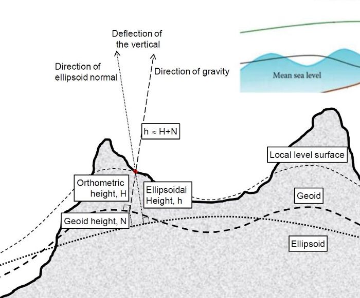

# Topic 1 Geo-reference system, 2D and 3D coordinate systems

## Polar coordinates
1. Position of a point is described with respect to an origin in terms of a linear (r) and an angular (θ) measurement.
- Need
    - A reference direction
    - A defined direction of angular measurement
- Two systems
    - Geomatics (compass) - clockwise from y
    - Mathematics - anticlockwise from x

## Cartesian coordinate system
1. Coordinate transformations
- Conformal, similarity or Helmert : Preserves angles (shape)
  - One scale, one rotation, two translations
- Affine (Preserves relative directions (parallel lines)) : 
  - Two scales, one rotation, two translations, one shear

## 3D coordinate systems
1.Main transformation is 3D conformal (One scale ,Three rotations ,Three translations)
  - Scale and translation are straight forward, Rotations are complicated
    - Most common system is omega, phi, kappa +ve anticlockwise when viewed towards the origin
        - Omega (ω) – about the X axis
        - Phi (φ) – about the Y axis
        - Kappa (κ) – about the Z axis
 • Rotations follow right hand screw rule

## Geo-coordinate systems

1. Longitude and Latitude On the Earth
- Great circles include
    - Equator
    - Meridians of longitude
- Small circles include : Parallels of latitude
- Poles include : North Pole ,South Pole

- Longitude, λ, Angle in Equatorial plane (Prime Meridian)
  -  +ve East and – ve West from 
- Latitude, φ Angle in meridional plane (the Equator)
  - +ve North and – ve South from 

## Gravity Causes difficulty in measuring heights over large areas
1. Different height systems
   - Orthometric height (H) : Height measured along the local vertical
   - Ellipsoidal height (h) : Height measured along the normal to the ellipsoid
   - Dynamic height : Height  measured  with  respect  to  equipotential surfaces
   - Geoid height (N) : Height difference between the geoid and the ellipsoid

